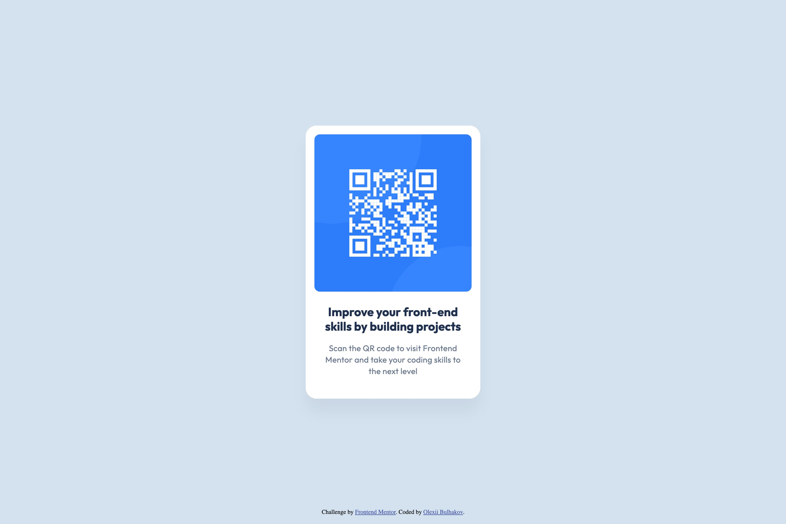

# Frontend Mentor - QR code component solution

This is a solution to the [QR code component challenge on Frontend Mentor](https://www.frontendmentor.io/challenges/qr-code-component-iux_sIO_H). Frontend Mentor challenges help you improve your coding skills by building realistic projects.

## Table of contents

- [Overview](#overview)
  - [Screenshot](#screenshot)
  - [Links](#links)
- [My process](#my-process)
  - [Built with](#built-with)
  - [What I learned](#what-i-learned)
  - [Continued development](#continued-development)
- [Author](#author)

## Overview

### Screenshot



### Links

- Solution URL: [GitHub repo](https://github.com/bulhakovolexii/qr-code-component)
- Live Site URL: [GinHub Pages](https://bulhakov.dev/qr-code-component/)

## My process

### Built with

- Semantic HTML5 markup
- CSS custom properties
- Flexbox
- [Normalize.css](https://necolas.github.io/normalize.css/)
- [Google fonts](https://fonts.google.com/)

### What I learned

I already had some experience in solving similar problems, so I decided to make the layout more adaptive, using Flexbox, and more improveable, using CSS variables.

In order not to worry about resetting built-in browser styles, I used Normalize.css.

### Continued development

Unfortunately, I found out that the standard CSS does not have such functions as mixins, although they would be appropriate for adding text styles. See the example below.

```scss
@mixin text-preset-1 {
  font: 700 22px/120% "Outfit", sans-serif;
  letter-spacing: 0px;
}

@mixin text-preset-2 {
  font: 400 15px/140% "Outfit", sans-serif;
  letter-spacing: 0.2px;
}
```

```scss
.card__title {
  @include text-preset-1;
  margin: 0;
  text-align: center;
  color: var(--slate-900);
}

.card__subtitle {
  @include text-preset-2;
  margin: 0;
  text-align: center;
  color: var(--slate-500);
}
```

## Author

- GitHub - [@bulhakovolexii](https://github.com/bulhakovolexii)
- Frontend Mentor - [@bulhakovolexii](https://www.frontendmentor.io/profile/bulhakovolexii)
- LinkedIn - [@yourusername](https://www.linkedin.com/in/bulhakovolexii/)
